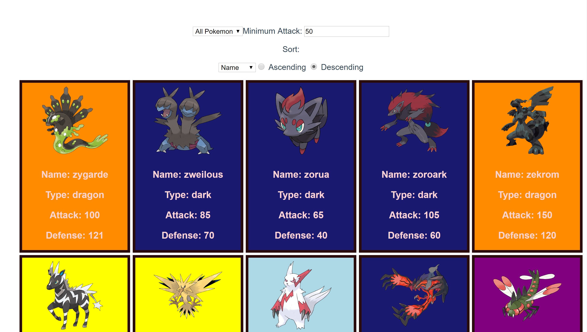

# _Pokedex_

#### _A Pokemon Filtering and Sorting Application, August 2018_

#### By _**Mike Lambert**_

## Description

_Using a dataset of over 800 Pokemon, this application applies sorting and filtering to dynamically show/hide Pokemon based upon user input._

## Setup/Installation Requirements

* _Download/Clone GitHub Repository_
* _Add dependencies/modules using "npm i" command_
* _Run server using "npm serve" script command_
* _Launch application in browser_

## Support and contact details

_Please feel free to reach out via email at mlamb128@gmail.com_

## Technologies Used

_Vue.js_

### License

*MIT*

Copyright (c) 2018 **_Michael Lambert_**
